# 📐 Visual Geometry Reasoning using Qwen2.5-VL


## 1. Project Summary
This project investigates whether supervised fine-tuning and GRPO can improve visual geometry reasoning in Qwen2.5-VL-3B-Instruct on the [CASIA-PGPS9K](https://nlpr.ia.ac.cn/databases/CASIA-PGPS9K/index.html) geometry benchmark.
I built a full training and evaluation pipeline using:

- Hugging Face TRL for SFT and GRPO training
- LoRA for parameter-efficient fine-tuning
- vLLM for high-throughput rollout generation
- A symbolic answer parser for robust comparison between model outputs and numeric ground-truth answers
- A curriculum-based GRPO setup that separates problems by rollout difficulty

The baseline Qwen2.5-VL-3B-Instruct model achieved:
| Split | Accuracy | Parse success rate |
|---|---|---|
| Validation | 22.2% |83.5%|
| Test| 22.4% |83.8%|

The best GRPO checkpoint improved held-out test accuracy from 22.4% to 28.9% and parse success rate from 83.5% to 90.86% on 1,007 untouched test problems, a +6.5 percentage-point gain on accuracy, corresponding to roughly 65 additional solved problems.

A rough two-proportion test gives z≈3.35, suggesting that this held-out test improvement is unlikely to be explained by sampling noise alone. A paired gain/loss analysis would be the preferred follow-up test if per-example predictions are available.

The main research finding is that the largest bottleneck is not just theorem knowledge. The biggest bottleneck appears to be object-theorem binding: the model often knows the relevant theorem but fails to bind it to the correct points, segments, angles, or circles in the diagram.

A second key finding is that GRPO works best when the model already has mixed correct and incorrect rollouts. It helped on easier and medium-difficulty curriculum buckets, but showed little additional improvement on the hardest buckets. High pass@k on HardA examples showed that the model can sometimes sample correct solutions, but GRPO did not reliably convert those sampled tail solutions into higher accuracy@1.

## 2. Dataset and Evaluation Setup
### Dataset
The project uses CASIA-PGPS9K, a visual geometry problem dataset with approximately 9K geometry problems across 30 problem types.

One useful feature of this dataset is that it includes structural and semantic clauses describing the geometry diagram, such as:
```
length(AB) = 8
angle(ABC) = 90
perpendicular(AB, CD)
collinear(A, B, C)
midpoint(M, AB)
```
These annotations are not given to the model at final evaluation, but they are useful for reward design and diagnostic analysis.

### Data Split
Some questions share the same geometry image. To avoid image-level leakage, I used a group-level split: all questions sharing the same image are assigned to the same split.

I also stratified the split to keep problem-type distributions similar across train, validation, and test.
| Split | Number of Problems | 
|---|---|
| Training | 7500 |
| Validation | 514 |
| Test| 1007 |

The test set was held out during prompt engineering, curriculum mining, checkpoint selection, and hyperparameter tuning. Validation was used for checkpoint selection and analysis.

### Data Processing
I performed several preprocessing steps:

- Converted some original LaTeX-style questions into natural language.
- Converted PGPS9K structural and semantic clauses into a normalized functional annotation format.
- Built a symbolic answer parser so the model can output decimals, fractions, radicals, π-expressions, units, or simple equations while still being fairly compared against the numeric ground truth.


### Evaluation Protocol
All reported main accuracy numbers are accuracy@1.

Evaluation uses:
```
Input: image + question only
Output format: <think>...</think><answer>...</answer>
Decoding: greedy
Seed: fixed, SamplingParams(seed=42)
```
No visual facts, theorem labels, object-theorem bindings, or PGPS9K clauses are included in the evaluation prompt.

Evaluation and training use the same base prompt format.

#### Answer Extraction and Checking
The evaluation pipeline is:
```
extract_answer → parse_numeric → check_answer
```

1. extract_answer: The evaluator extracts the substring inside the first valid <answer>...</answer> block. Anything outside the first <answer> block is ignored.
2. parse_numeric: The parser reduces many model output formats to floats, including:
```
\frac{1}{2}
\sqrt{3}
2\pi
3 + \sqrt{5}
30°
2.5 cm
x = 7
≈ 12.6
```
If the parser extracts multiple comma-separated values, such as:
```
x = 4, y = 7
```
the prediction is counted correct if any extracted value matches the gold answer within tolerance.

3. check_answer
The answer is considered correct if ∣pred−gold∣<0.01.

4. The following cases are counted as wrong:
```
No <answer> tag
Unclosed <answer> tag
No parseable answer inside <answer>
Parsed answer differs from gold by ≥ 0.01
```

## 3. Baseline Results
The baseline Qwen2.5-VL-3B-Instruct model was evaluated with image + question only.
| Split | Accuracy | Parse success rate |
|---|---|---|
| Validation | 22.2% |83.5%|
| Test| 22.4% |83.8%|

### Baseline Accuracy by Problem Type
The baseline model has very uneven performance across geometry types. Some theorem families are nearly unsolved, while simpler area, angle, and perimeter problems are much more tractable.
| Problem Type | Accuracy |Correct/Total|
|---|---|---|
| Angle Bisector of Triangle | 0% |0/6|
| Geometric Mean| 0% | 0/10|
| Polygon Angle| 0% | 0/11|
| Secant Angle  | 5.9% | 1/17|
| Secant Segment   | 6.7% |1/15|
| Circle Chord| 7.5% |3/40|
| Inscribed Angle| 10% |2/20|
| Median of Triangle| 14.3% |2/14|
| Similarity in Parallel Line| 15.4% |2/13|
| Tangent    | 16.7% |2/12|
| Perimeter and Area of Polygon| 16.7% |1/6|
| Rhombus and Square| 18.2% |4/22|
| Parallel Lines    | 18.8% |6/32|
| Trapezoid and Kite| 21.4% |6/28|
|Perimeter and Area of Triangle|22.2%|2/9|
| Line Segment  | 22.2% |2/9|
| Circumference and Area of Circle| 23.5% |8/34|
| Polygon Congruence | 25% | 3/12|
| Pythagorean Theorem| 25% |2/8|
| Midsegment of Triangle| 26.7% |4/15|
| Trigonometry| 28.1% |9/32|
| Angle Relation in Triangle| 28.6% |4/14|
| Isosceles (Equilateral) Triangle| 31.6% |6/19|
|  Polygon Similarity| 35% |7/20|
| Arc Angle | 35.7% |5/14|
| Parallelogram| 37.5% |9/24|
| Rectangle | 37.5% |3/8|
| Angle| 38.9% |7/18|
| Perpendicular Bisector of Triangle| 40% |2/5|
| Perimeter and Area of Quadrangle| 40.7% |11/27|

### Baseline Failure Analysis
#### Visual Hallucination
Example question:
> BD bisects angle ABC. Find the measure of angle DBC.
> {width=100px height=100px}
The model correctly identifies expressions such as 2x+7 and 4x−9, but hallucinates a triangle relation that is not present in the diagram. It states:
> “The sum of angles in a triangle is 180 degrees. Therefore, angle ABD + angle CBD + angle DBC = 180.”
This suggests the model sometimes recognizes local visual text but fails to ground the overall geometric structure.

#### Geometry Relationship Confusion
Example question:
>VWXY is a rhombus. Find angle WXY if angle WVY = 4b + 10 and angle XZW = 10b - 5.
>{width=100px height=100px}

The model recognizes relevant properties of a rhombus:
```
All sides are equal.
The diagonals of a rhombus bisect each other at right angles.
```
However, it incorrectly states that angle WVY and angle XZW are complementary angles.

This is not a pure theorem-recall failure. The model knows some rhombus facts, but applies the wrong relationship to the wrong diagram objects.

#### Theorem Blindness
Example question:
> In triangle PQR, PS = 8, QS = 14. Find RS
> 
The model fails to use the geometric mean theorem and instead tries to apply the Pythagorean theorem, producing an incorrect answer.

This suggests that the model needs stronger theorem selection and theorem-application ability.

## Diagnostic Oracle Ablations
To better understand the bottlenecks, I ran oracle-assisted prompt ablations. These are diagnostic upper-bound experiments, not deployable end-to-end evaluations. They use information generated by stronger models or dataset annotations to identify which missing capabilities most constrain the 3B model.

| Prompt | Accuracy on validation dataset |
|---|---|
| Question + Image | 22.2% |
| Question + Image + Relevant visual facts | 30.4% |
| Question + Relevant visual facts| 31.1% |
| Question + Relevant visual facts + Relevant theorems | 39.1% |
| Question + Relevant visual facts + Relevant theorems + Object-theoream Bindings | 69.1% |
| Question + + Relevant theorems + Object-theoream Bindings | 50% |

These ablations suggest:

1. Relevant visual facts alone improve performance from 22.2% → 30.4%.
2. Removing the image but keeping relevant visual facts gives similar accuracy, 31.1%, suggesting that extracting useful diagram facts is a major bottleneck.
3. Adding relevant theorems improves accuracy to 39.1%.
4. Adding object-theorem bindings improves accuracy dramatically to 69.1%.
5. Removing visual facts while keeping theorem bindings drops performance to 50.0%, showing that theorem binding and visual grounding are both important.

To verify that theorem improvements were not merely due to longer prompts, I injected random theorems. Accuracy dropped back to 31.7%, close to the visual-facts-only setting.

### Main Diagnosis
The largest bottleneck is object-theorem binding.

The model may know a theorem such as the Pythagorean theorem, angle bisector theorem, or geometric mean theorem, but it often fails to bind the theorem to the correct sides, angles, or auxiliary points in the diagram.

The next major bottleneck is extracting useful visual facts from the diagram.

## 4. Supervised Fine-Tuning Experiments
I first explored SFT because the failure analysis suggested the model needed more explicit supervision on visual grounding, theorem selection, and object-theorem binding.

All SFT variants used the same 1,500 sampled training examples from PGPS9K. I used stratified sampling and upsampled problem types where the baseline model performed poorly.

### Summary of SFT Variants
| Version | Method |Validation Accuracy| Main Observation|
|---|---|---|---|
| 1.1 | Teacher-generated solutions | 17.7% |Severe output degeneration and long reasoning loops|
| 1.2 | Teacher-corrected student responses |~baseline| Teacher corrections still shifted the response distribution|
| 2.1| Rejection-sampling SFT from Qwen’s own correct responses |+1 pp|Stable but small improvement|
| 2.2 |Hint-augmented rejection-sampling SFT using object-theorem bindings | 22.4% |Close to baseline; no robust gain|


### Version 1.1: Teacher-Generated Responses
I used Gemini 2.5 Pro to generate solutions that explicitly mentioned relevant visual facts and theorems. These responses were too verbose, so I asked Claude Sonnet to rewrite them more concisely while preserving key reasoning steps.

However, SFT on these traces caused degeneration in the model’s outputs.
| Metric | Baseline | Version 1 |
|---|---|---|
| **Accuracy** | 22.2% | 17.7% |
| Min token length | 39 | 30 |
| Max token length | 3893 | 8,053 |
| Mean token length | 431.6| 1,360.7 |
| Median token length | 216 | 192 |
|P90|523|7,905  |
|p99|3,823 | 8,013 |

The model began producing long degenerative reasoning loops. A likely cause is response-distribution shift: the teacher traces were stylistically and structurally different from the native Qwen2.5-VL response distribution.

### Version 1.2: Teacher-Corrected Student Responses
To reduce response-distribution shift, I asked Qwen to generate responses first, then asked Claude Sonnet to correct the reasoning.

The goal was to preserve the model’s native style while fixing key errors. However, this did not improve accuracy. Inspection showed that the first one or two sentences often remained close to the original Qwen response, but the rest of the reasoning was heavily rewritten by the teacher, still causing a distribution mismatch.

### Version 2.1: Rejection-Sampling Fine-Tuning
Since teacher-generated traces did not transfer well, I tried using the model’s own successful responses.

The pipeline was:
```
Generate multiple Qwen responses
Keep correct responses
SFT on the correct native-style traces
```
This was more stable than teacher SFT and improved validation accuracy by about 1 percentage point, but the gain was small.

### Version 2.2: Hint-Augmented Rejection-Sampling Fine-Tuning
Version 2.1 only reinforces behaviors the model can already produce. To expose object-theorem binding, I injected object-theorem bindings into the prompt during data generation, asked the model to generate reasoning that explicitly used them, then kept correct responses for SFT.

However, this checkpoint achieved 22.4% validation accuracy, close to baseline.

### SFT Conclusion
Under these data sizes and labeling strategies, SFT did not produce a robust improvement over the baseline.

The main failure modes were:
```
Teacher-generated traces caused response-distribution shift.
Rejection-sampling SFT was stable but only reinforced already-surfaced behaviors.
Hint-augmented SFT did not reliably teach object-theorem binding.
```
Because SFT did not provide a strong baseline improvement, I used the original baseline model as the starting point for GRPO.

## 5. GRPO Curriculum Training
### Curriculum Construction
I classified training problems by sampling multiple rollouts from the baseline model.

For each problem, I sampled 4 rollouts at temperature 0.6.
```
3–4 correct rollouts → Easy
1–2 correct rollouts → Medium
0 correct rollouts   → Hard
```

The hard bucket was further split by sampling 8 more rollouts:
```
At least 1 correct rollout → HardA
0 correct rollouts         → HardB
```
This produced a curriculum:
```
GRPO-Easy → GRPO-Medium → GRPO-HardA → GRPO-HardB
```
The motivation is that GRPO is most useful when each prompt group has mixed outcomes: at least one good rollout and at least one bad rollout. All-zero groups provide little useful learning signal.

### GRPO Training Configuration
| Setting | Value |
|---|---|
|PEFT method|LoRA|
|LoRA rank|32|
|LoRA alpha|64|
|LoRA dropout|0.05|
|LoRA initialization|Kaiming, init_lora_weights=True|
|Target modules|Language model + vision MLP + merger/projector|
|Trainable parameters|74.9M|
|Optimizer|AdamW|
|Rollouts per prompt|8|
|Effective prompts per step|16|
|Max completion length|2048|
|Loss type|grpo|
|Reward scaling|batch|
|GRPO clip / importance sampling| TRL GRPOConfig default|
|Precision| bf16|

I used scale_rewards="batch" rather than group-level scaling to reduce question-level difficulty bias from per-group normalization.

### KL Coefficients
| GRPO Stage | KL Beta |
|---|---|
|GRPO-Easy|0.02|
|GRPO-Medium|0.01|
|GRPO-HardA|0.005|
|GRPO-HardB|0.005|

Each stage was trained for one epoch. Additional epochs did not produce clear improvements in reward or validation accuracy.

### Reward design
The reward design has the same basic answer-format skeleton across stages.
#### Coupled Answer + Format Reward
```
Correct answer + strict <think>...</think><answer>...</answer> format → 1.0
Correct answer + loose format                                      → 0.5
Wrong answer                                                       → 0.0
```
Strict formatting requires both <think> and <answer> tags. Loose format requires both \<answer\> tags to be present, but it can include the following cases
```
1. 1. Missing <think> block entirely: <answer>5</answer> — extracts "5" but strict regex requires
  <think>...</think> first.
2. Extra text outside the tags: Sure! <think>r</think> <answer>5</answer> Hope that helps.
3. Tags in wrong order: <answer>5</answer> <think>reasoning</think> — extractable, not strict.
4. Multiple <think> blocks
5. Non-whitespace between </think> and <answer>: <think>r</think>. The answer is <answer>5</answer>. extractable, not strict.                           
```
The correct answer + loose format only showed up 0.2% in the validation examples. 

#### Visual Fact Coverage
PGPS9K provides annotated geometric clauses such as:
```
length(AB) = 8
angle(ABC) = 90
perpendicular(AB, CD)
collinear(A, B, C)
```

I treat these as visual facts the model should ideally use in its reasoning.

For each clause, I parse:
```
predicate type: length, angle, parallel, midpoint, ...
point names: A, B, C, ...
optional value: 8, 90, ...
```
Then I split the model’s <think> reasoning into sentences and slide a ±1 sentence window across the reasoning.

A clause is matched if:
```
For value-bearing clauses:
  the value appears in a sentence
  and all point names appear within that sentence's ±1 window

For predicate clauses:
  a predicate keyword appears in a sentence
  and all point names appear within that sentence's ±1 window

For pure point/line declarations:
  filtered out so they do not inflate the score
```
The final score is:

$$
\text{visual fact coverage} = \frac{\text{matched non-trivial clauses​}}{\text{total non-trivial clauses}}
$$

The ±1 sentence window is important because real reasoning often spans adjacent sentences. For example:
```
Given AB = 8.
Using the Pythagorean theorem, AC² = AB² + BC².
```
The value may appear in one sentence while the relevant point names appear in the next.

This matching is surface-level string/regex matching. It uses word-boundary checks for point names, simple value normalization, and a small predicate-to-keyword map. It does not verify that the reasoning is logically valid.

#### Theorem Coverage
For each problem, I use a list of theorem names judged relevant by Gemini 2.5 Pro, such as:
```
Angle Bisector Theorem
Triangle Angle Sum
Pythagorean Theorem
Geometric Mean Theorem
```

For each gold theorem, the model receives a score based on vocabulary overlap with its reasoning.

The scoring procedure is:
```
1. Lowercase the theorem name and reasoning.
2. If the full theorem name appears verbatim, score = 1.0.
3. Otherwise:
   - tokenize the theorem name
   - remove stopwords
   - apply crude stemming
   - compute the fraction of theorem tokens appearing in the reasoning
```
Example:
```
Gold theorem: "angle bisector theorem"
Gold tokens: {angle, bisector, theorem}
Reasoning: "angle bisector property"
Score: 2 / 3 = 0.67
```

The final theorem coverage is:

$$
\text{theorem coverage} = \text{mean theorem score across relevant theorems}
$$

This is essentially bag-of-words token overlap with stemming. It is easy to game by sprinkling theorem vocabulary, so in Easy, Medium, and HardA it is only used as a multiplier on already-correct answers.

#### GRPO-Easy Reward
GRPO-Easy uses only the coupled answer-format reward: R=answer_reward
where
```
w_answer = 1.0
grounding weights = 0.0
```
Rationale: start with a dense reward signal on problems where the model already has high success probability.

#### GRPO-Medium Reward
GRPO-Medium adds grounding bonuses multiplicatively on top of correct answers:

$$
R = w_{\text{answer}} \cdot \text{answer reward} \cdot (1+ w_{\text{facts}}​ \cdot \text{fact coverage} + w_{\text{theorems}} \cdot \text{theorem coverage})
$$

with
```
w_answer = 1.0
w_facts = 0.15
w_theorems = 0.15
```
Wrong rollouts receive 0 regardless of fact or theorem coverage.

#### GRPO-HardA Reward
GRPO-HardA uses the same reward as GRPO-Medium.

The goal is to reinforce correct hard-sample rollouts while encouraging the correct responses to mention relevant visual facts and theorems.

#### GRPO-HardB Reward
HardB contains problems where the model produced zero correct rollouts during mining. Sparse final-answer reward gives almost no gradient in this setting, so I used a decoupled reward:
$$
R= w_{\text{answer}} ​\cdot \text{answer reward} + w_{\text{facts}} \cdot \text{fact coverage} + w_{\text{theorems}} ​\cdot \text{theorem coverage} + w_{\text{loop}}\cdot \text{is loop}
$$

with
```
w_answer = 1.0
w_facts = 0.15
w_theorems = 0.15
w_loop = -0.2
aux_wrong_multiplier = 1.0
loop_token_limit = 800
```

In HardB, grounding reward is not gated by correctness. Wrong rollouts can earn grounding bonus. This was intended to provide some gradient when correct rollouts are essentially nonexistent.

This introduces reward-hacking risk, so answer accuracy, reward mean, KL, entropy, and loop behavior were monitored separately.

#### Loop Detection
A rollout is flagged as a loop if:
```
is_loop = (
    not has_answer_tags
    or detect_repetition(text)
    or comp_len > loop_token_limit
)
```
The repetition detector slides a 50-character window over the response and flags the response if any 50-character n-gram appears at least 3 times.

This is a simple character-level detector, not a semantic loop detector.

### GRPO Training Diagnostics
For each stage, I tracked:
```
reward mean
reward standard deviation
GRPO loss
KL
entropy
gen_prompt_correct
gen_overall_correct
```

where
```
gen_prompt_correct = percentage of prompts with at least one correct rollout
gen_overall_correct = percentage of generated rollouts that are correct
```

The GRPO loss is a policy surrogate loss, not a supervised cross-entropy loss. Therefore, negative loss values are expected and are not by themselves a sign of failure.

Reward standard deviation is also expected to be high because the reward is sparse: most rollouts receive 0, while correct strict rollouts receive 1+ bonus.

The more important diagnostics are whether reward mean, rollout correctness, KL, and entropy move together.

#### GRPO Easy Results
In GRPO-Easy, gen_prompt_correct stayed between 95% and 100%, meaning almost every prompt group had at least one correct rollout.

gen_overall_correct increased from the 40% range to the 60% range.

This suggests GRPO was effective when the model already had dense positive signal.

| Reward mean | Reward std |
| :---: | :---: |
| 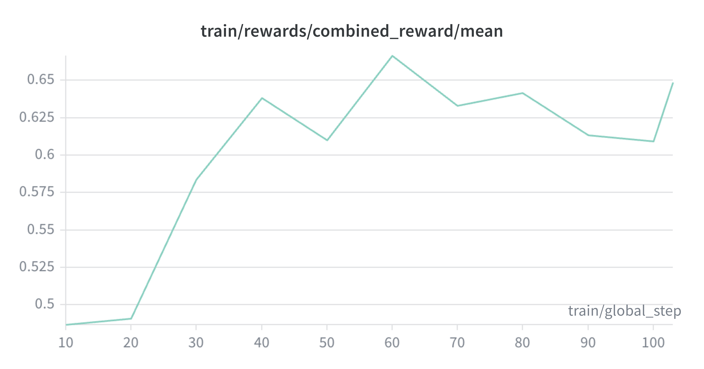 | 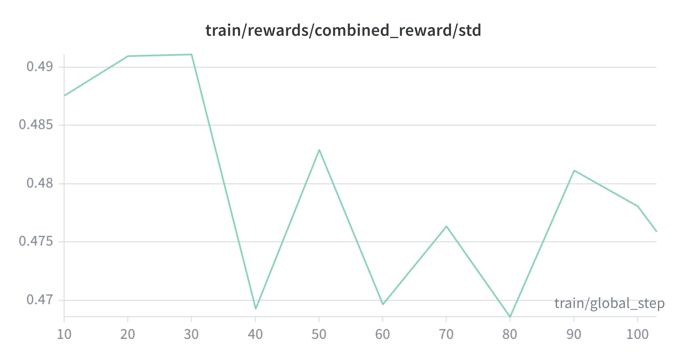 | 

| KL| Entropy | Loss |
| :---: | :---: |:---: |
| 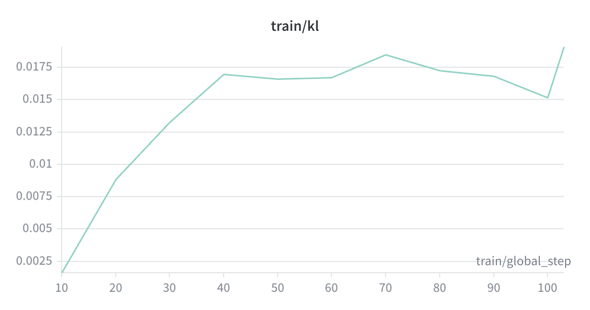 | 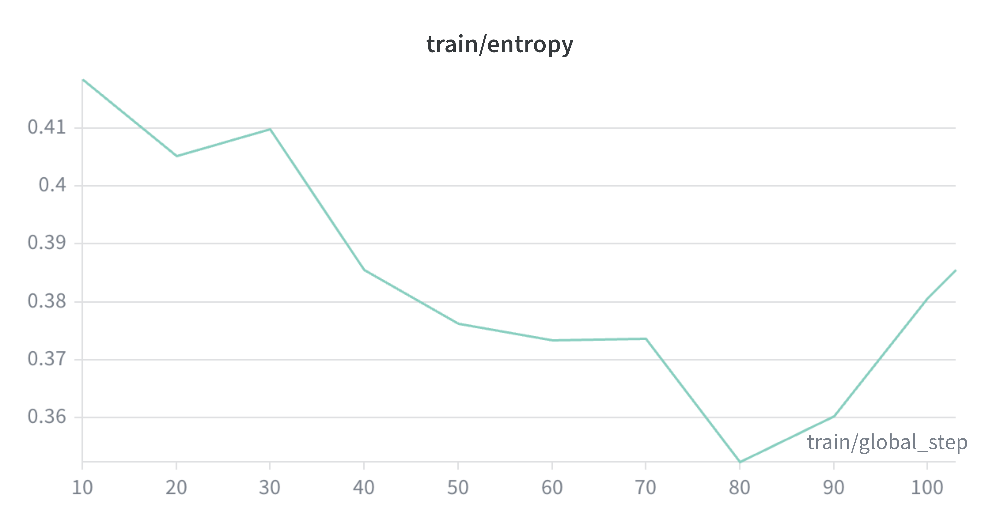 |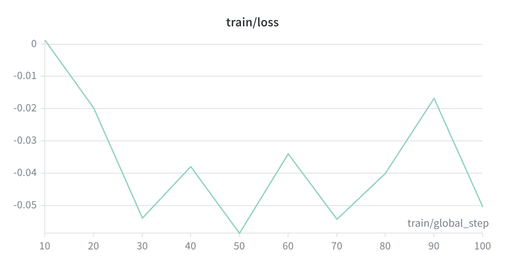 |

#### GRPO-Medium Results
In GRPO-Medium, gen_prompt_correct stayed between 80% and 90%.

gen_overall_correct increased from roughly 29–33% to 35–40%.

This was the most productive GRPO stage in terms of validation accuracy.

| Reward mean | Reward std |
| :---: | :---: |
| 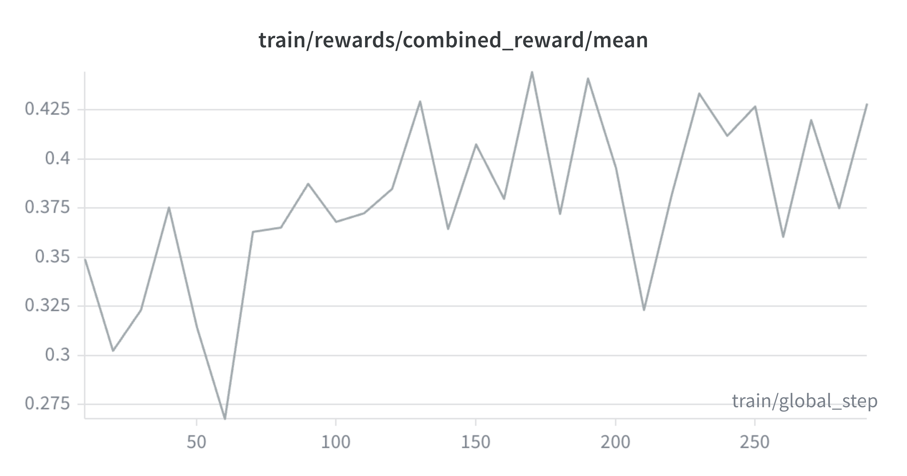 | 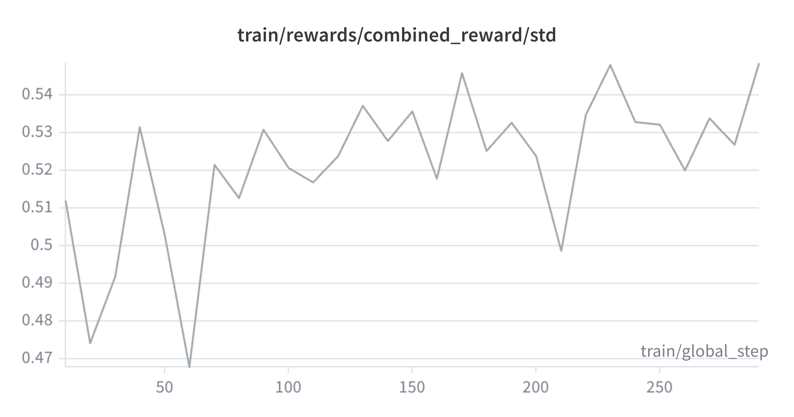 | 

| KL| Entropy | Loss |
| :---: | :---: |:---: |
| 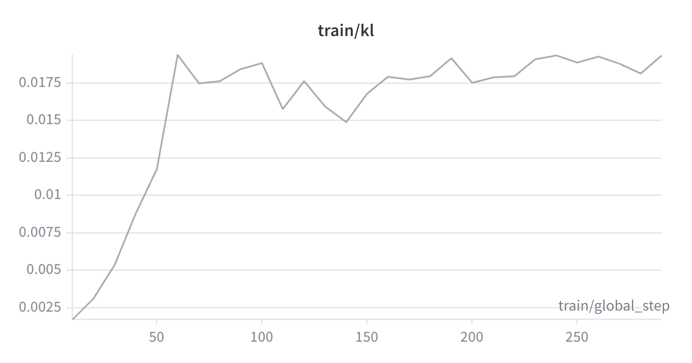 | 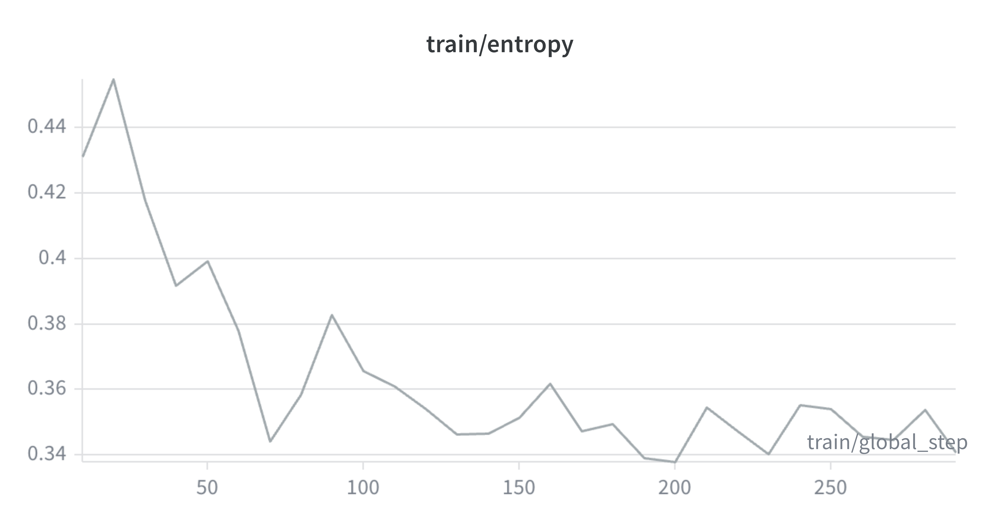 |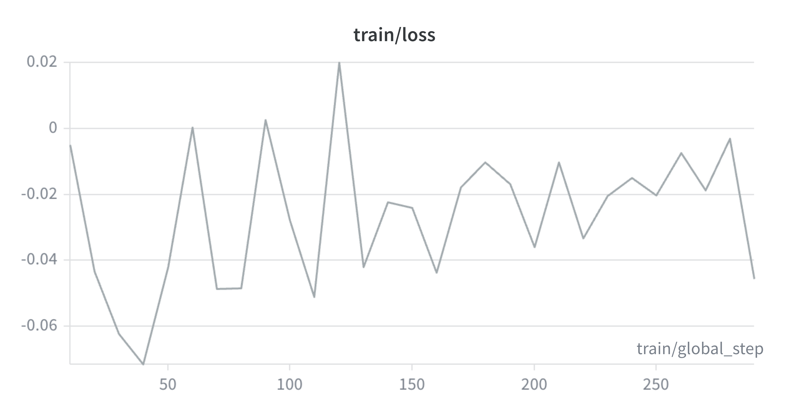 |

Training dynamics were generally healthy:
```
Reward mean increased.
KL rose early and then stabilized.
Entropy decreased and then stabilized.
Loss was noisy and sometimes negative, which is normal for GRPO.
```
Validation accuracy improved from approximately 23.0% to 26.5%. On 514 validation examples, this is promising but not statistically conclusive by itself. The rough 95% confidence interval for the improvement includes zero.

#### GRPO-HardA Results
HardA contains problems where the model had zero correct rollouts under k=4 mining, but at least one correct rollout under k=8 mining.

This means the model has some latent ability on these examples, but correct solutions are less frequent.
| Reward mean | Reward std |
| :---: | :---: |
| 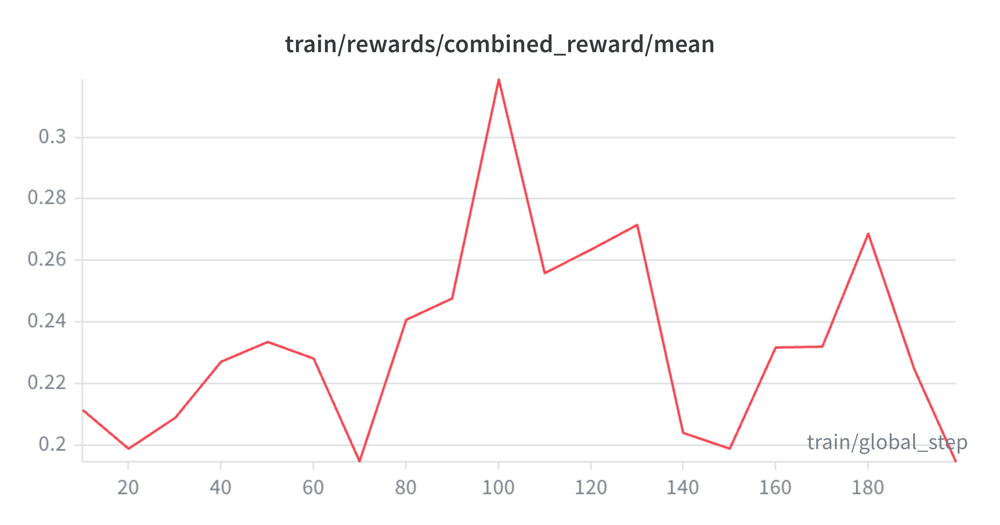 | 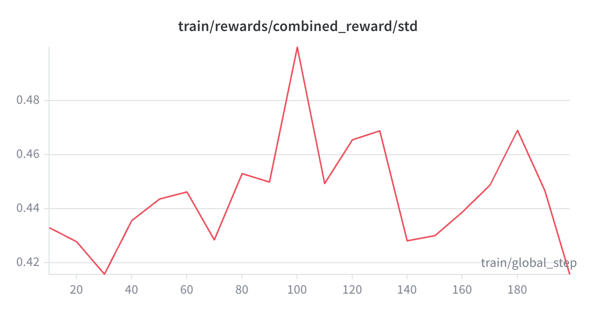 | 

| KL| Entropy | Loss |
| :---: | :---: |:---: |
| 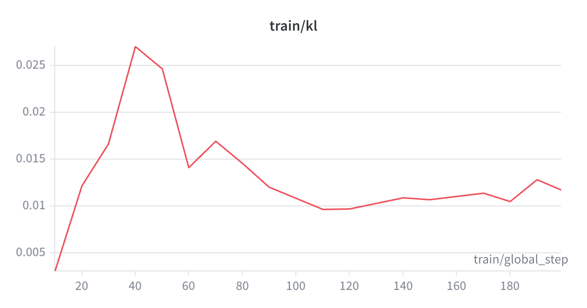 | 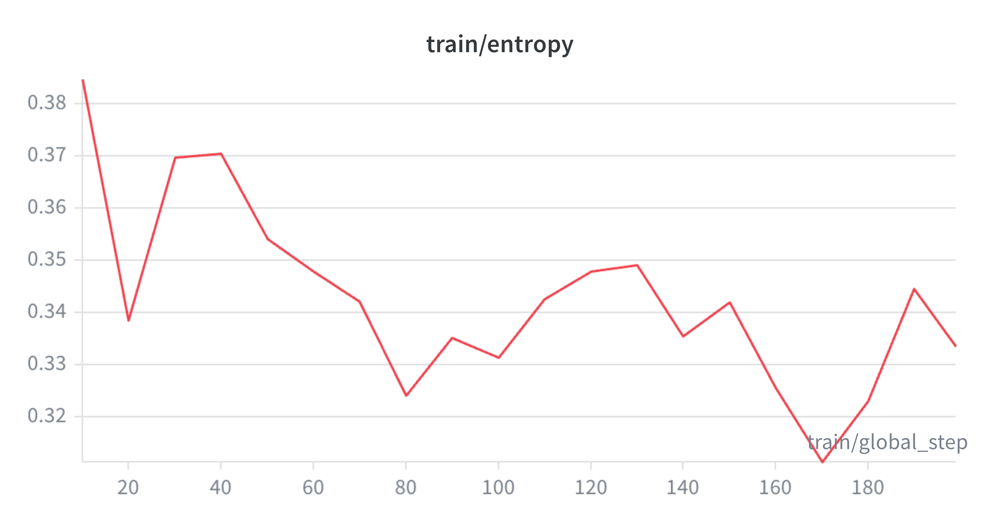 |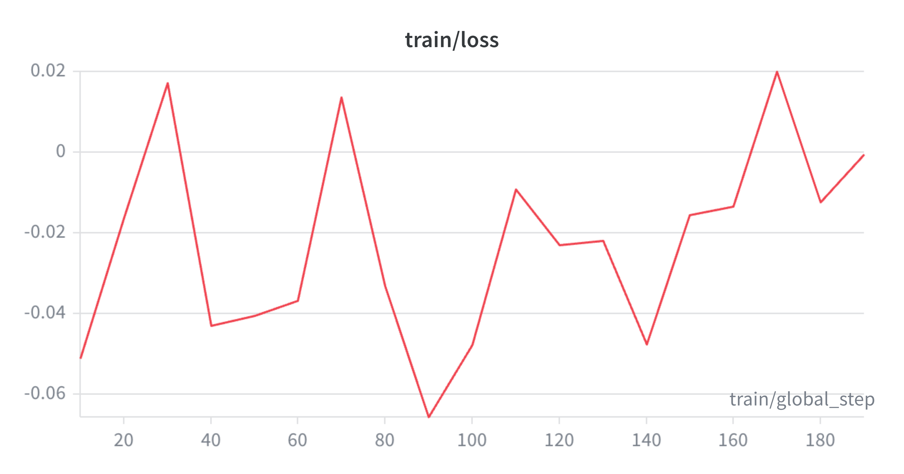 |

The validation improvement from GRPO-Medium to GRPO-HardA was small and likely noisy. However, the GRPO-HardA checkpoint was selected as the best validation checkpoint for final test evaluation.

#### GRPO-HardB Results
HardB contains the hardest problems: examples where the model produced zero correct rollouts even after additional sampling.

As expected, GRPO-HardB did not show clear learning. gen_prompt_correct, gen_overall_correct, and reward dynamics were mostly flat.

| Reward mean | Reward std |
| :---: | :---: |
| 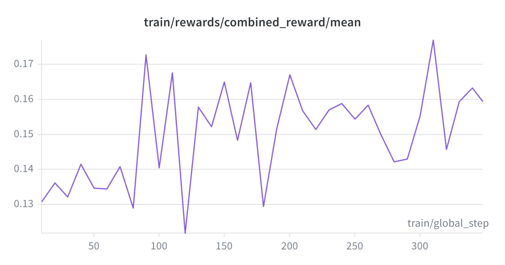 | 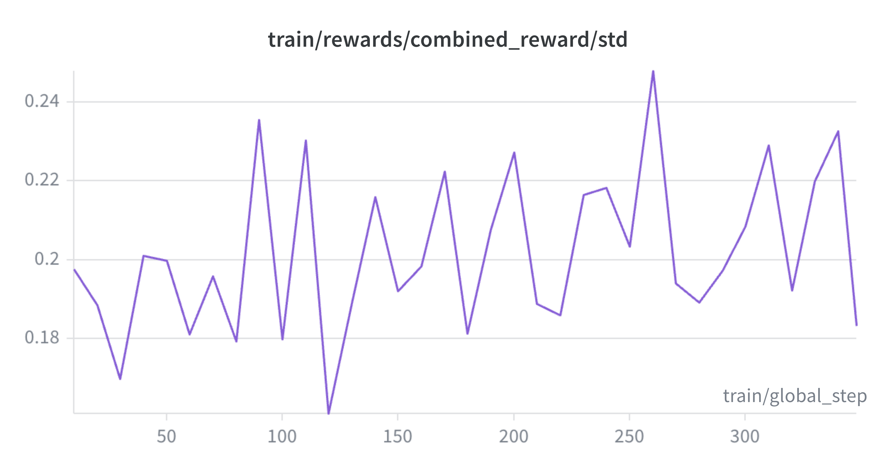 | 

| KL| Entropy | Loss |
| :---: | :---: |:---: |
| 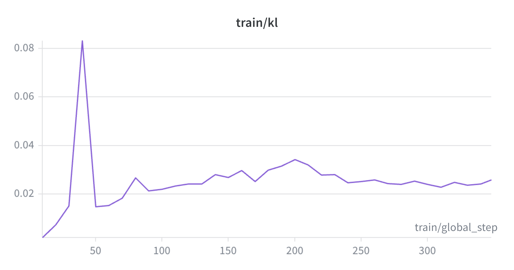 | 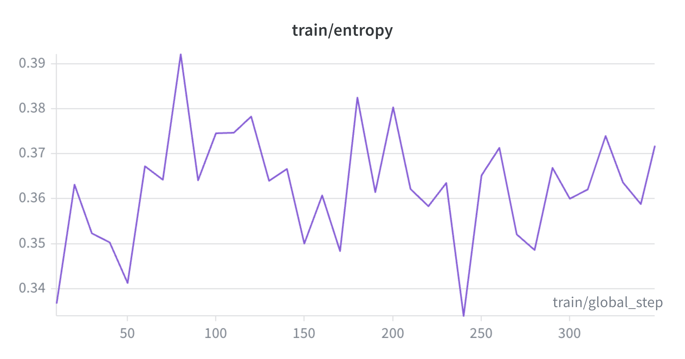 |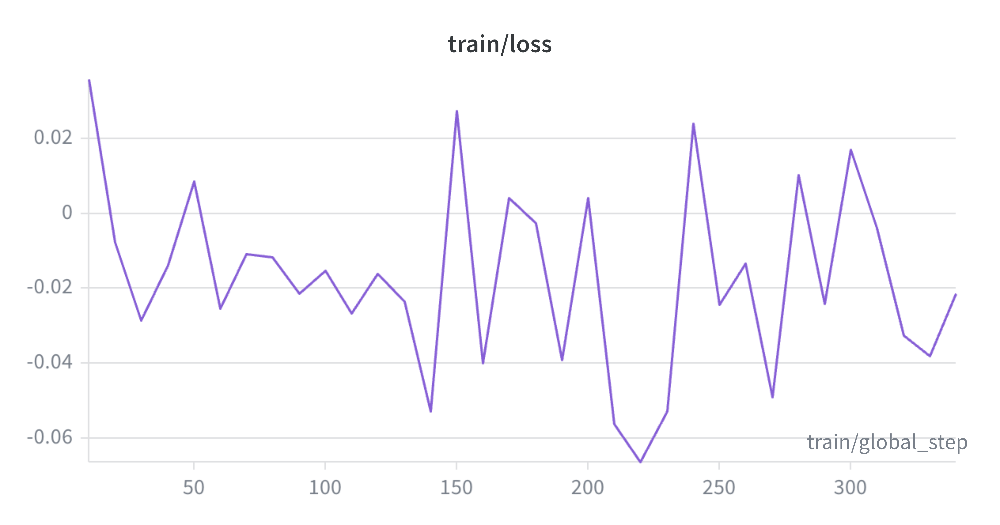 |

The decoupled HardB reward provided some gradient through fact and theorem coverage, but this did not translate into better validation accuracy.

This suggests that HardB may require stronger supervision, teacher traces, verifier-guided training, or a better curriculum before GRPO becomes useful.


### Stage-wise Evaluation Results
| Stage | Accuracy on Validation data |
|---|---|
|Baseline| 22.2%|
|GRPO-Easy | 23%|
|GRPO-Medium| 26.5%|
|GRPO-HardA|27.2%|
|GRPO-HardB|27.2%|

The best checkpoint was selected from GRPO-HardA.

Final held-out test result:
| Stage | Accuracy on Test data |
|---|---|
|Baseline| 22.4%|
|Best GRPO checkpoint | 28.9%|

This is a +6.5 percentage-point improvement on 1,007 untouched test problems.

A rough two-proportion calculation gives:

$$
SE \approx 0.0194\\
z = \frac{0.289−0.224}{0.0194} \approx 3.35
$$

So the held-out test gain is likely real, although a paired gain/loss analysis would be a better test if per-example predictions are available.

### K=8 vs K=16 GRPO Analysis
I sampled 500 examples from HardA and measured pass@k:
| Metric | Value |
|---|---|
|pass@8| 68.2%|
|pass@16 | 82.2%|

This suggested that the model has substantial latent ability: many HardA problems can be solved somewhere in the sampling tail.

I then compared two GRPO-HardA runs:
| Run | Validation Accuracy |
|---|---|
|K=8 GRPO| 27.2%|
|K=16 GRPO | 26.7%|

The difference is only about 0.5 percentage points, roughly 2–3 validation problems, so it is likely noise. However, the important result is that K=16 did not clearly improve over K=8 despite higher pass@16.

During training, K=16 had approximately twice the KL of K=8, while reward was very similar.

This suggests K=16 was less KL-efficient: it moved the model farther away from the reference policy without improving validation accuracy.

Why higher pass@k did not guarantee better accuracy@1? pass@k measures whether a correct solution appears somewhere in the sampling tail. Accuracy@1 measures whether the model’s default output is correct. These are different objectives. A problem may look like this under K=16 sampling:
```
15 wrong rollouts
1 correct rollout
```
pass@16 counts this as solved, but GRPO still has to turn a rare sampled correct trajectory into high-probability behavior. That is a difficult credit-assignment problem, especially in visual geometry. The extra K=16 correct rollouts may also include:
```
rare tail solutions
lucky final answers
partially incorrect reasoning with correct answer
problem-type-specific strategies
non-generalizable theorem applications
```
GRPO reinforces whatever receives reward, but it does not necessarily preserve broad geometry competence. 

### GRPO Analysis
I sampled 500 problems from stage 3A training data. The model's pass@8 on the sample is 65%, and its pass@16 is around 82%. I ran two versions of stage 3A one using k=8 and the other using k=16. However, the accuracy of the k=16 run is not higher than the k=8 run. Although the model clearly has some latent ability and can find correct solutions in its sampling tail, but GRPO is not effectively moving those solutions into the default high-probability behavior. I compared the problem types in the validation data the k=8 checkpoint and k=16 checkpoints solved respectively, and found that k=16 improved some problems types but regressed on other types. That looks like strategy shifting, not uniform improvement. The k=16 checkpoint may have become better at certain theorem families while forgetting or destabilizing others. So the overall average barely moves. The training reinforces whatever wins in the sampled rollouts, but it does not necessarily preserve broad geometry competence.

Stage 3B have more difficult problems than 3A, so it's expected that GRPO in stage 3B does not show improvement. Based on the findings from SFT and GRPO, I think a better way is to experiment on-policy ditillation: leverage the teacher model's ability in RL environment. 

### Qualitative Examples

### Per Problem Type Comparison
| Problem Type | N| Baseline Accuracy |Best GRPO checkpoint| Delta Correct|
|---|---|---|---|---|
| Angle Bisector of Triangle |6| 0% |16.7%| +1|
| Geometric Mean| 10| 0% | 10.0%| +1|
| Polygon Angle| 11| 0% | 9.1%| +1|
| Secant Angle  | 17|5.9% | 11.8%| +1|
| Secant Segment   |15| 6.7% |20%| +2|
| Circle Chord| 40| 7.5% |12.5%| +2|
| Inscribed Angle| 20| 10% |10%| 0|
| Median of Triangle| 14| 14.3% |7.1%| -1|
| Similarity in Parallel Line| 13| 15.4% |30.8%| +2|
| Tangent    | 12| 16.7% |33.3%| +2|
| Perimeter and Area of Polygon| 6| 16.7% |50%| +2|
| Rhombus and Square| 22| 18.2% |27.3%| +2|
| Parallel Lines    | 32| 18.8% |31.2%| + 4|
| Trapezoid and Kite| 28| 21.4% |17.9%|-1|
|Perimeter and Area of Triangle|9| 22.2%|22.2%|0|
| Line Segment  | 9| 22.2% |44.4%|+2|
| Circumference and Area of Circle|34| 23.5% |29.4%| +2|
| Polygon Congruence | 12| 25% | 16.7%| -1|
| Pythagorean Theorem|8| 25% | 50%| +2|
| Midsegment of Triangle| 15 | 26.7% |53.3%|+4|
| Trigonometry| 32| 28.1% |25.0%| -1|
| Angle Relation in Triangle| 14| 28.6% |28.6%| 0|
| Isosceles (Equilateral) Triangle|19| 31.6% |21.1%| -2|
| Polygon Similarity| 20| 35% |35%| 0|
| Arc Angle |14| 35.7% |28.6%| -1|
| Parallelogram| 24| 37.5% |33.3%|-1|
| Rectangle | 8| 37.5% | 75| +3|
| Angle| 18| 38.9% |44.4%| +1|
| Perpendicular Bisector of Triangle| 5| 40% |40% | 0|
| Perimeter and Area of Quadrangle| 27| 40.7% |40.7%| 0|                                                                                                       


## On-Policy Distillation (In Progress)


